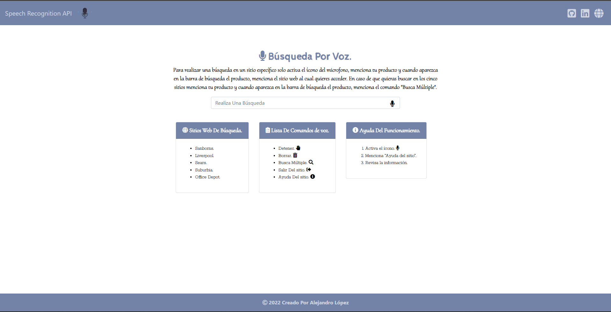

# <h1 align="center" style="color: #7283a7;"> Speech Recognition WebSite 👨🏻‍💻 </h1> 
  

This web application allows you to search for products on different websites which is done with voice recognition using the `Web Speech API`.

Learn how to add `Speech Recognition` to your websites and web applications with JavaScript, using the Web Speech API. Speech recognition involves receiving speech through a device's microphone, which is then checked by a speech recognition service and a result is returned as a text string.

`Web Speech API` allows for Speech Recognition in the browser, using JavaScript. This opens up many new possibilities regarding user interaction with websites and web applications.
  

## 
 Requirements 

- [HTML5](https://developer.mozilla.org/es/docs/Web/HTML) 
- [CSS3](https://developer.mozilla.org/es/docs/Web/CSS)
- [JavaScript](https://developer.mozilla.org/es/docs/Web/JavaScript)

## 
 References 

- [Web Speech API](https://developer.mozilla.org/en-US/docs/Web/API/Web_Speech_API)
- [Speech Recognition](https://developer.mozilla.org/en-US/docs/Web/API/SpeechRecognition) 

  

## 
 Screenshot Project 💻 

🔶 [Project Website](https://alejandro-lopez.futuretecware.com/Speech-Recognition-WebSite/index.html)

